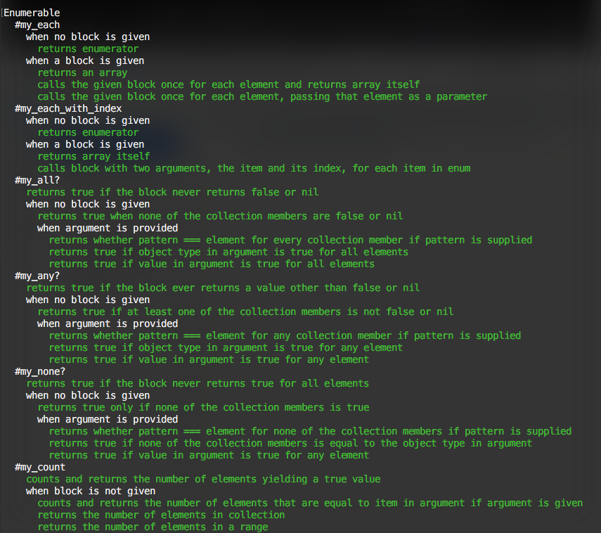

# Using-RSpec-to-Test-Projects

> In this project I used RSpec to create and run unit tests for previously completed projects in Ruby.

In this project I created two test example files for two Ruby projects I had previously created, one for an Enumerables Module project (project link is [here](https://github.com/StarSheriff2/Enumerables)), and one for a Tic Tac Toe game (project link is [here](https://github.com/StarSheriff2/rb-tic-tac-toe)).
I used RSpec to build unit tests for every method in the enumerable module, #each, #each_with_index, #select, #all?, #any?, #none?, #count, #map, and #inject; and for the game file of the Tic Tac Toe game, game.rb, testing the main gameplay methods.

## Built With

- Ruby
- Rspec gem
- VSCode

## Instructions

1. Open your terminal or command prompt.
2. If you don't have git installed in your system, skip this step and go to step 3. If you do have git installed in your system, clone this repository to your computer in any directory you want by copying this text into your command prompt/terminal: `git clone https://github.com/StarSheriff2/Using-RSpec-to-Test-Projects.git`. Now go to step 6.
3. If you don't have git installed in your system, you can download the project files. To do this, click on the green button that says "**Code**", on the upper right side of the project frame.
4. You will see a dropdown menu. Click on "**Download ZIP**".
5. Go to the directory where you downloaded the **ZIP file** and open it. Extract its contents to any directory you want in your system.
6. If you are not in your system terminal/command prompt already, please open it and go to the directory where you cloned the remote repository or extracted the project files.
7. While in the root directory, type `bundle install`. This will install Rspec in your system, in case you don't have it installed already. (It also installs Rubocop; however, this gem is necessary to make the project work).
8. Finally, run the tests by typing the command `rspec --format doc` to see test results.

## Live Example

- to run the tests in this live example, type this in the Shell: `rspec --format doc`

- [Repl.it link](https://repl.it/@StarSheriff2/Using-RSpec-to-Test-Projects).

## Author

👤 **Arturo Alvarez**

- GitHub: [@StarSheriff2](https://github.com/StarSheriff2)
- Twitter: [@Turo_83](https://twitter.com/Turo_83)
- LinkedIn: [Carlos Alvarez](https://www.linkedin.com/in/carlosalvarezveroy/)

## Contributing

Contributions, issues, and feature requests are welcome!

Feel free to check the [issues page](https://github.com/StarSheriff2/Using-RSpec-to-Test-Projects/issues).

## Show your support

Give a ⭐️ if you like this project!

## 📝 License

This project is [MIT](https://github.com/StarSheriff2/Using-RSpec-to-Test-Projects/blob/main/LICENSE) licensed, thanks.
